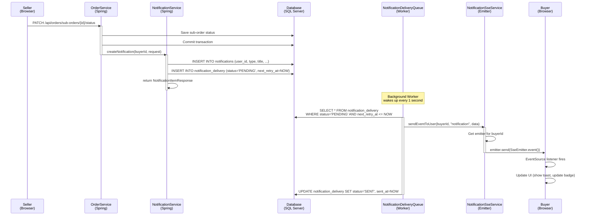
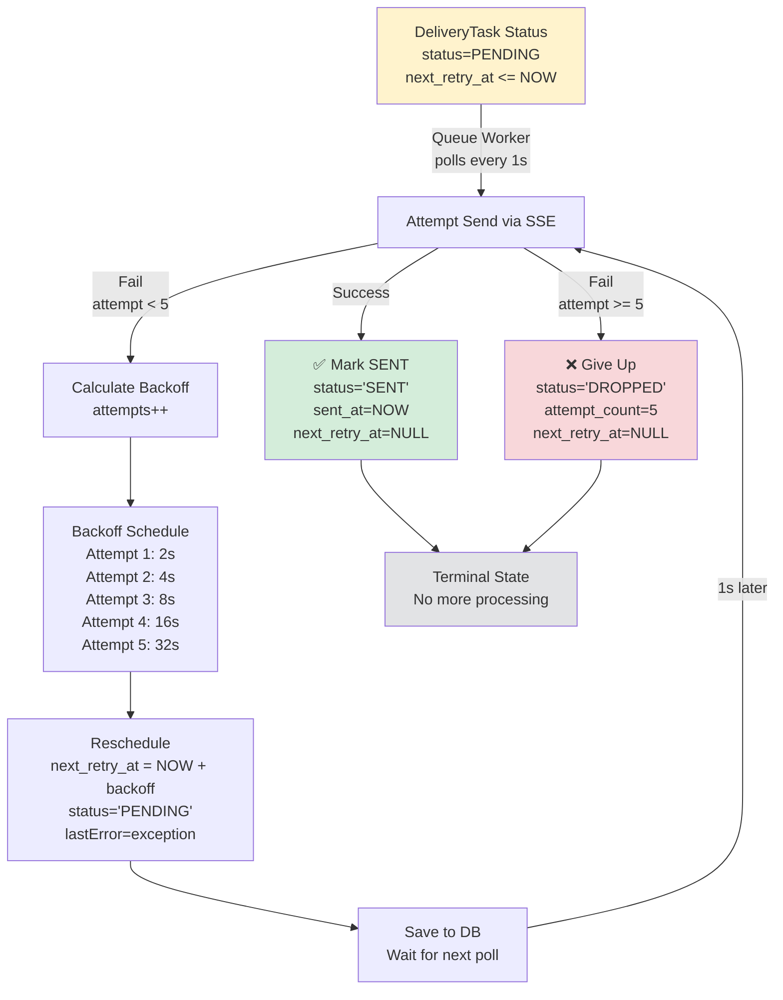
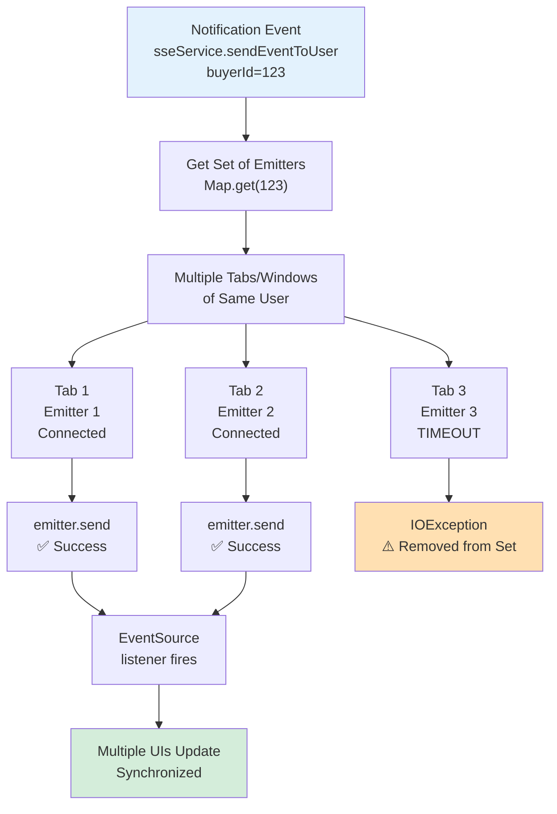
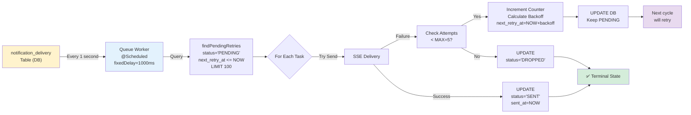
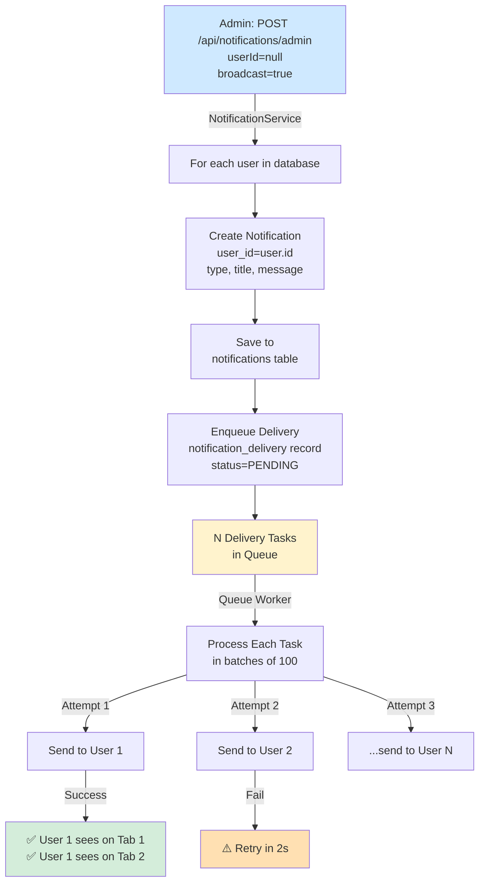
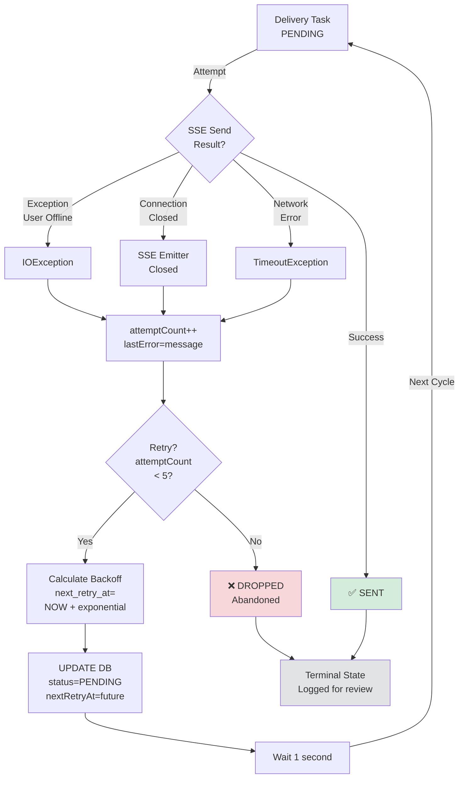
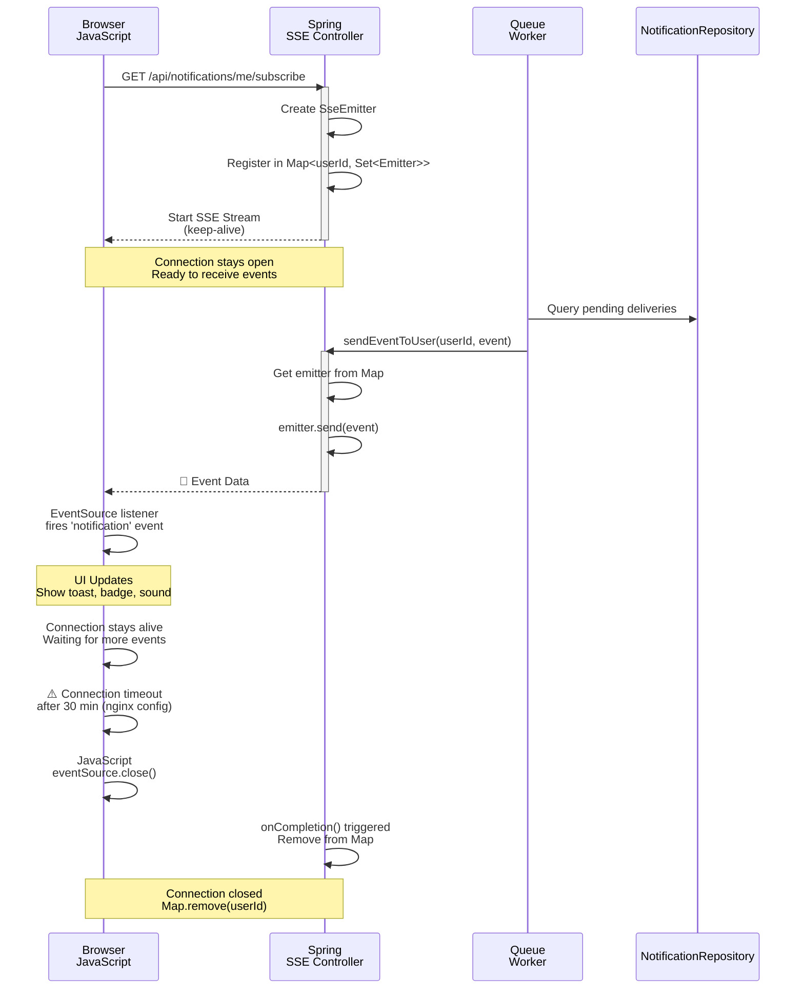
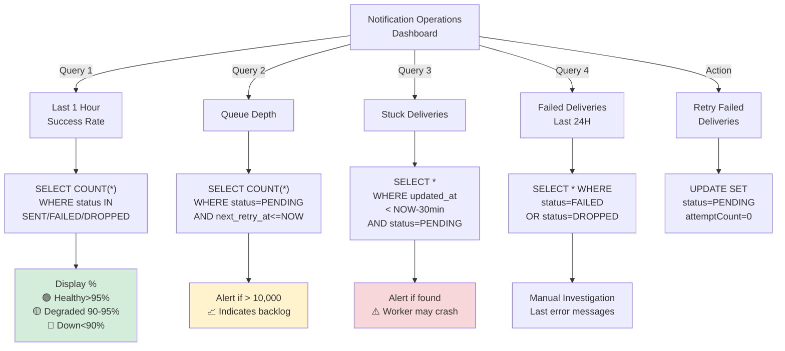
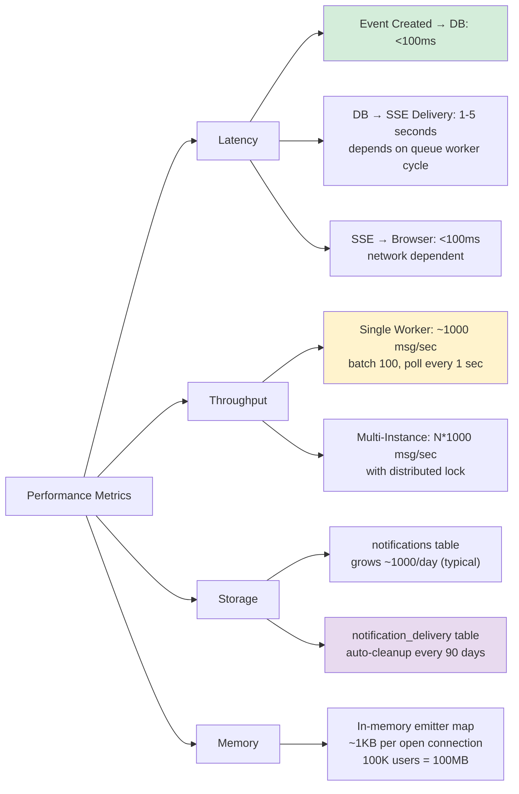

# Notification System - Flow Diagrams

## 1. Notification Creation & Delivery Workflow

---

## 2. Retry Logic & Exponential Backoff

---

## 3. SSE Multi-Tab Connection Management

---

## 4. DB-Backed Queue Architecture

---

## 5. Fan-out Broadcast Flow

---

## 6. Error Handling & Recovery

---

## 7. SSE Connection Lifecycle

---

## 8. Monitoring & Operations Dashboard

---

## 9. Performance Characteristics

---

## 10. Deployment Checklist

```mermaid
graph TD
    A["Pre-Deployment<br/>Checklist"]
    
    A --> B["Database"]
    B --> B1["✅ V7 migration created<br/>notification_delivery table"]
    B --> B2["✅ Indexes created<br/>IX_notification_delivery_pending_retry<br/>IX_notification_delivery_by_notification"]
    
    A --> C["Application"]
    C --> C1["✅ NotificationDelivery entity<br/>NotificationDeliveryRepository"]
    C --> C2["✅ Queue worker refactored<br/>reads from DB, not in-memory"]
    C --> C3["✅ Tests pass<br/>mvn compile"]
    
    A --> D["Configuration"]
    D --> D1["✅ SecurityConfig updated<br/>auth rules for /api/notifications/**"]
    D --> D2["✅ @Scheduled enabled<br/>@EnableScheduling in config"]
    
    A --> E["Monitoring"]
    E --> E1["✅ Alerts configured<br/>success rate, queue depth"]
    E --> E2["✅ Dashboard created<br/>health checks, failed deliveries"]
    
    A --> F["Testing"]
    F --> F1["✅ Integration test<br/>create notification → verify delivery"]
    F --> F2["✅ Load test<br/>100 concurrent users"]
    F --> F3["✅ Failover test<br/>kill worker, verify recovery"]
    
    style B1 fill:#d4edda
    style C3 fill:#d4edda
    style F3 fill:#d4edda
```

---

## Legend & Symbols

| Symbol | Meaning |
|--------|---------|
| ✅ | Success, Task completed |
| ❌ | Failed, Dropped, Terminal failure |
| ⚠️ | Warning, Potential issue |
| 📨 | Message/Event transmitted |
| 🟢 | Healthy |
| 🟡 | Degraded |
| 🔴 | Critical/Down |

---

**Usage**: 
- Use these diagrams in documentation, wiki, or training materials
- Update periodically as architecture evolves
- Reference specific diagrams when discussing issues
